# Getting Started : Web for Admin

Welcome to AlphaByte! This is where we help you get acquainted with all the features so that you can use them to manage your library with ease. Here, you’ll find a step by step guide on how to use all the features available.You can come back to this section whenever required by clicking on [the help icon](wudimages/Aspose.Words.1866fca9-b1ea-47ab-b7d2-ed8dafc92ee1.001.png) on the top right of the screen.

Here are some quick steps you can take to make sure you successfully set up your library with AlphaByte to take maximum advantage of the platform. We've included support links for each step in case you need any further explanation of how something works.

1. [Set up an admin hierarchy](#adminfunctionclearance) and add each admin individually or [import admin details](#importadmindetails) quickly with a csv file.
2. Add books and assets using [mass import](#importbooks) via settings or [individually](#addnewmaterial) via the add page. As you add new assets to the library, a unique QR code is generated for each copy of the item. Print and apply these QR codes to the respective items. This will enable you to perform quick scan searches on the items in future.
3. Register issuers (students or teachers) with [mass import](#importuserdetails) or add new issuers [individually](#addnewuser).
4. Set up [virtual shelves](#virtualshelves) to reflect your physical shelf organization. Print and apply QR codes for each shelf to successfully keep track of all items on each shelf.
5. Checkout the [records section](#records) for report generation and you're all set. 
6. Go ahead and announce in the [chatroom](#chatroom) that you're ready to roll out books.

## Home Explained

On the homescreen you will find a shortcut to every page you need.

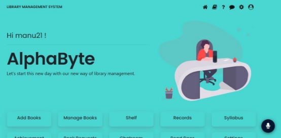

Moving further down you will find a summary of how your library is performing in terms of :
1. Most Issued Books : Top 5 books/resources most issued by users recently.
2. Books in Demand : Top 5 books/resources most reserved by users recently.
3. Most Requested Books : Top 5 books/resources most requested by users recently.

## Your Profile

Click on 

on the upper right corner of the screen. From here you can change your password or logout of your account. 

### Changing password.

To change your password :

1. Click on CHANGE PASSWORD situated above the logout button.

2. A small form opens up. 
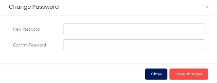
3. Enter your new password and confirm your password by entering the same again.
4. Click on “save changes” to save your changed password or “cancel” in case you change your mind.

## Voice Navigation

### How to use voice navigation?
We offer you complete voice navigation throughout the website with just one click on

You’ll find it in the lower right corner of your screen on every page to enable you to voice navigate in and out of everywhere. To use it successfully:

1. Click on

. Make sure your microphone is on and working.
2. Frame your command and say it. It is wise to use keywords relevant to the site and your task to be done. 

#### An Example of voice command

Saying “Search Python Programming book in add assets page”  or “Search for Python Programming book from the internet” will result in opening the ADD ASSETS page with the search results for “Python Programming book” as shown below.

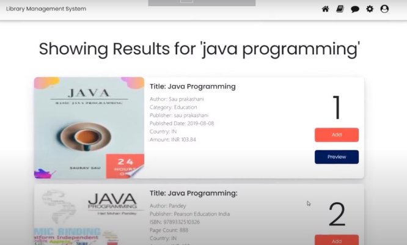

The voice assistant will help you further in accomplishing tasks vocally.

## Search
Searching any book or shelf or asset in your library can be done in the following three ways

### Voice search.

To use the speech recognition feature click on 

on the search bar.

Click on 

 and say the name of the book/ author name/ ISBN number/ BookID/ CopyID into your device’s microphone.  For other assets specify similar appropriate parameters to search.

More on how to use voice navigation [here](#voicenav).

### Manual type search.

To perform type search click on the space provided for typing_ _on the search bar.

Simply type in the name of the book/ author name/ ISBN number/ BookID/ CopyID to find the book in your library. For other assets use similar appropriate parameters to search.

### Scan search.

To use the scanner click on 

_ _beside the SEARCH button.

You can scan the [QR code](#printQRcode) on the asset ( if attached previously, during addition of the book to the library) or on the shelf (if applied previously, during creation of the shelf) to quickly find all information regarding that shelf or asset. 

## Adding new material to your library.
To add new material to your library go to the ADD ASSETS page by clicking on the book icon in NavBar in the top right of your screen.

You can also use voice navigation to do the same. 

### Adding new material from the internet
Addition of a new material available on the internet can be easily done by following the steps given below.

#### 1. Finding the book you want
1. Once in the ADD ASSETS page, voice search or type search the book you want in the search bar. For more guidance on searching checkout the [search section](#search) of this document)
2. Based on your search, a list of books will be displayed.
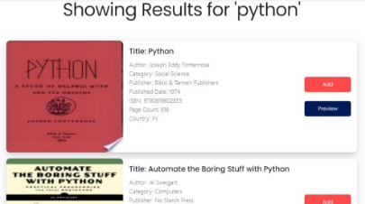

3. You can preview some of the initial contents of these books by clicking on the PREVIEW button.
4. Click on the ADD button next to the book you want to add in the library 

#### 2.   Filling the form

1. Once you click on ADD, a form will open with auto-filled details of the book fetched from the internet.
2. The categories, DDC number and BookID will automatically be generated by AlphaByte.

3. You can change the details as you feel apt by clicking on the input box next to it.

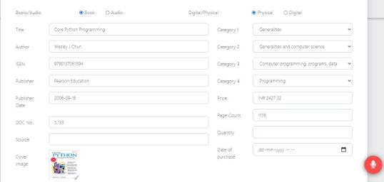

4. The highlighted parameters are optional and are for your convenience. You can choose to (not) fill them as per your library needs. 
5. Click the SUBMIT button to add your new asset to the database.

### Adding new material manually

You can quickly add new material to the library without searching the internet.

1. Click on _the + button_ to open the DETAILS form.
2. Fill in all the details related to your new material.

## Manage made easy.

### How to find a book?
To find any book, follow one of these steps:

1. Search the name of the book directly on the search bar
2. Or scan the QR Code of the book by clicking on SCAN button
3. Or use voice based search by clicking on

 icon in the search bar.  
4. Use the Filter tool to filter based on category or type to easily find your book.

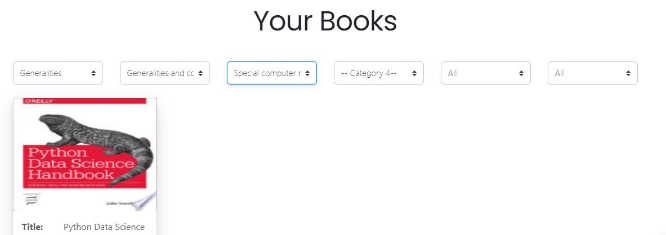
5. Directly click on the SEARCH button to see all the books present in the Library .

### How to Update a book?

1. Once you find your book, click on the UPDATE button.
2. A filled form with all the details related to the book will appear.
3. Change the details you would like to update.
4. You can also add copies to existing quantities of the same book here.

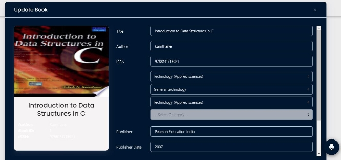

5. Click on UPDATE button at the bottom of the form to save the changes in the database. 

### How to Issue a book?

1. Once you find your book, click on the  ISSUE/RETURN/DELETE button.
2. A pop up will open showing all the copies of books

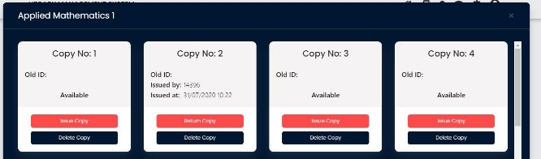

3. If the book is not currently Issued , you will find a red ISSUE button.
4. After Clicking on the ISSUE button, type the ID of the issuer and click on the Blue ISSUE button to issue that copy.

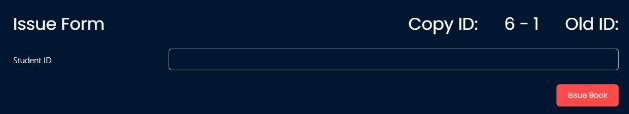

### How to Return a book?

Once you find your book, click on the RED BUTTON which says Issue/Return/Delete
A pop up will open showing all the copies of books
If the book is currently Issued by anyone , you will find a Red RETURN button.

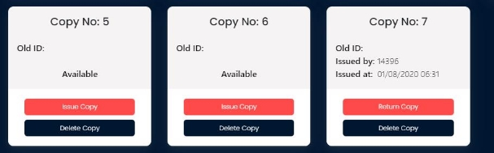

After Clicking on the RETURN button, fine calculation will be presented below.
Users can choose to pay fines now or later.
Due Fines can be seen on the RECORD page (Check documentation of Record page for more details)
You can add extra fine for any physical damage made to the books.
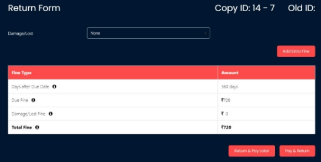
 
Click Pay & Return button if fine is paid or Return and Pay later button if not paid.

### How to Print QR codes?

If QR Code is damaged or lost for any of the books, you can print them again from the MANAGE page

1. Once you find your book, click on _the Info button_
2. You can see all the information regarding the book and the number of copies issued, reserved or available here.

3. At the right bottom of this page is an option for you to generate QR code.

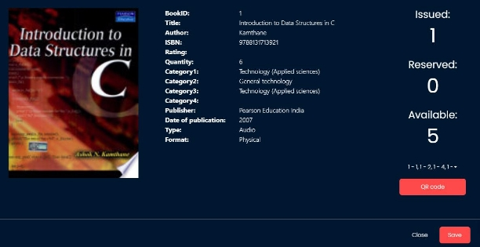

4. Select the copies for which you would like to generate QR Code from the dropdown.
5. Click on the QR CODE button to generate qr codes for those copies. 

### How to Delete a book?

1. Search your book in the MANAGE page (for more information on searching methods checkout the search section of this document)
2. Once you find the book, click on the ISSUE/RETURN/DELETE button.
3. A pop up will open showing all the copies of books

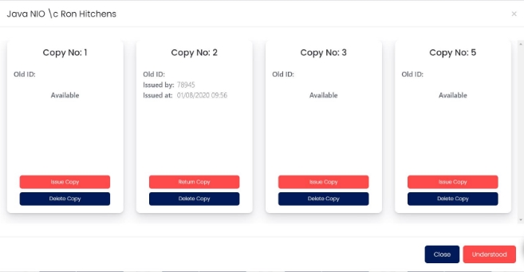

4. Click on the DELETE button below any particular copy you would like to delete. 
5. That copy of the book will be deleted from the database.

*Records and history of the copies you delete will still remain. You will still be able to generate a report of the actions made on the book/copy whenever required. *

## Your Virtual Shelves.
You can manage your Physical Shelves Virtually in the system.
Click on the SHELF tab present in the NavBar at the top right corner of your screen.
Here you can see all the shelves that you may have updated in the system

### How do I add a new shelf?

1. Click on the 

 Sign on the SHELF Page.
2. Type in the name/ID you would like to assign to this shelf and click the ADD button just below it.
3. You will find the newly added shelf in the top of the screen

### How do I delete a shelf ?

1. Choose a shelf which you would like to delete in SHELF page.
2. On the bottom right corner of the chosen shelf there will be a DELETE button
3. Click on the DELETE button to remove shelf from from the database

### How do I update books on a shelf?

#### To remove books from a shelf

1. In SHELF Page search for the shelf from which you would like to remove or add a book.
2. Once in the shelf, you will be able to see all the Books in that shelf and all information regarding that shelf.
3. Click the remove button situated below the book you would like to remove from that shelf.

#### To add books to a shelf

4. To add a book , on the right side of the shelf you have entered there should be an ADD BOOK button.
5. Clicking on it will take you to a search page page where you can type or speak the name of the book you want to add
6. Once you find the book, click on the show copies button below it to see all the present copies of the book and where they are shelved.

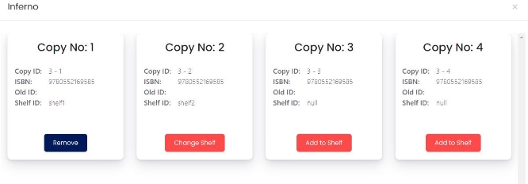

7. Find the copy of the book with the help of COPY ID and click on the ADD button on the right of it

#### To change the shelf assigned to a book
8. If that copy is already present in some other shelf, it will show you the name of the shelf it is present in and an option to change the position of the book.
9. Click on the CHANGE SHELF button to remove the book from the previous shelf and add it to the current one.

## Uploading syllabus for your users.
You can create new branches and upload the books and materials in your library that are officially recommended as per the respective syllabi. This will help your library users to access these relevant books easily.

### How do I add a new Branch and Sem?

1. Click on the 

 Sign on the Syllabus Page.
2. Write the name of the branch and Number of sems in that branch.

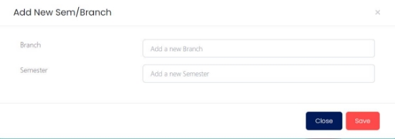

3. Click on the SAVE button to add that branch in the database.

### How do I delete a Branch and Sem?

1. Search the branch you would like to delete or Scroll down to it.
2. Click on the Bin icon 

 Next to that branch.
3. Branch would be deleted directly.

### How to Add/Delete books in particular Semester.

1. Click on the semester you would like to add books to.
2. On the Right Side of the card opened click on the Select Book(s) dropdown button.
3. Search the book you would like to add from the database.

## Customize via settings.

Click on  in the NavBar on the top right of your screen to open the settings page. Here you can easily customize AlphaByte according to your library needs.

### General Settings.

You can change all the major customisable parameters like how long an user can issue a book in general settings

1. Go to GENERAL SETTINGS tab in the SETTINGS page
2. Here you will find a list of parameters that are customisable

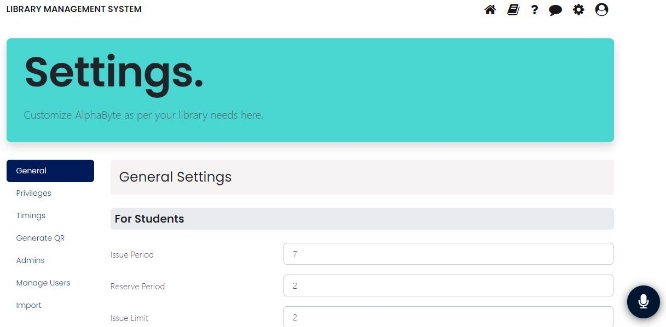

3. Click on the input box next to the parameter you would like to change.

### Managing User

#### New User 

1. To register a new user, go to MANAGE USER tab placed in the right side of SETTINGS page
2. Select the type of member to be USER , then select the ADD radio button to generate a form
3. Select the type of user i.e teacher/student and fill the necessary credentials in the form.

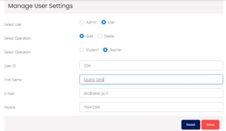

4. Click the SAVE button to add a new user in the database.

#### Remove User

1. To remove an existing user select the DELETE radio button.
2. Search user with their ID 

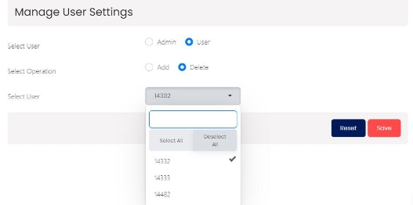

3. Once found the correct user click on the SAVE button to make changes
4. Click the SAVE button to add a new user in the database.

#### Remove Admin

1. To remove an existing Admin select the DELETE radio button.
2. Search user from their NAME

#### New Admin

1. To add a new user, go to MANAGE USER tab placed in the right side of SETTINGS page
2. Select the type of member to be ADMIN, then select the ADD radio button to generate a form
3. Fill the necessary credentials in the form and click the SAVE button to add a new user in the database

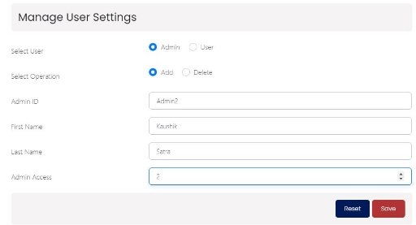

4. Click the SAVE button to add a new user in the database.

#### Remove Admin

1. To remove an existing Admin select the DELETE radio button.
1. Search user from their NAME

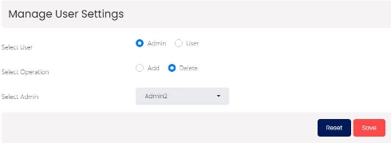

3. Once found the correct admin click on the SAVE button to make changes.

### Setting admin privileges

1. To select what level of admin can make what changes, go to the PRIVILEGES tab placed in the right side of SETTINGS page
2. Here you can see various functions a librarian can perform and has a number next to it.
3. Clearance ranges from 1-3 where an Admin with higher clearance level can access all the features with value below it.

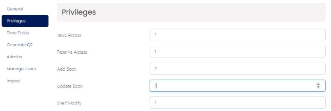

4. Add a number next to function to set what group of admins can access those functions

### Import your existing database.
Click on the IMPORT tab in SETTINGS page 
Existing Database should be in CSV format with some compulsory columns.

#### Importing Student/Teacher database
1. Create a CSV file of your existing database of users.
2. Compulsory parameters are: Student/Teacher ID (stud ID) and Student/Teacher name (name)
3. Optional parameters are: Email (email) and Mobile number (mobile)
4. Click on the CHOOSE FILE button next to IMPORT STUDENTS/TEACHERS button and upload your csv file.

#### Importing Admin database
1. Create a CSV file of your existing database of admins
2. Amin ID (adminID) is the compulsory parameter.
3. Optional parameters are: first name (fname) Last name (lname) and clearance level (clearance)

#### Importing Books database
1. Create a CSV file of your existing database of books
2. TITLE, AUTHOR and ISBN are compulsory parameters to be present
3. Optional parameters are: publisher, pages, date of publication, price, oldID, purchaseTime, purchaseSource.
4. Click on the CHOOSE FILE button next to IMPORT BOOKS button and upload your csv file.
5. The system will automatically categorize books based on title and isbn and add them to AlphaByte’s database.

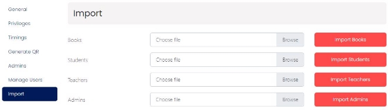

*Importing may take some time based on the size of data , so be patient :)*

### Print QR codes in bulk.

You can use this feature to generate QR Codes of a set of books or shelves.
1. Click on the GENERATE QR tab in the settings page.
2. Select the books or shelves for which you want to generate codes here.

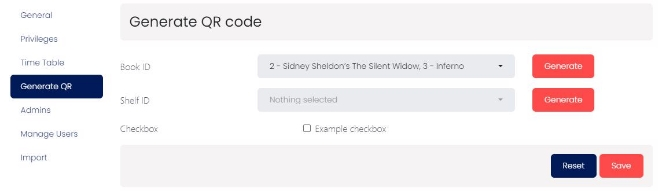

3. Click on the GENERATE button to get those codes.

4. Print and paste these codes on respective books and shelves.

### View and change admin function clearance.

#### What is admin function clearance?

 Different levels of hierarchy can be created and assigned to admins. These different levels can then be set to limited or extended access to management functions in the library. One such example of a hierarchical admin clearance system is given below:
  <ol>
    <li>Level 1 admin can only ISSUE or RETURN a book</li>
    <li>Level 2 admin can can ADD or REMOVE BOOKS from database along with all the features that level 1
</li>
    <li>Level 3 admin can make the changes in the settings, add or remove USER and essentially make all changes.
</li>
  </ol>

#### How to set admin function clearance?

To Change the clearance assigned to an admin:

1. Go to the ADMIN tab placed in the left navigation of SETTINGS page.
1. Select the clearance level next to Admin name from 1-3 , 3 being the highest level of clearance and 1 being the lowest.

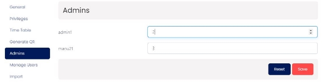

3. Click on SAVE button to save changes

## Records
This page helps you keep track of bills, dues and activities in your library.
To access this page click on 

and select the RECORDS tab present in the NavBar at the top right corner of your screen.

### Report Generation
To see the history of actions done in your library Report generation can be used
Click on the REPORT TABLE button in the Records page

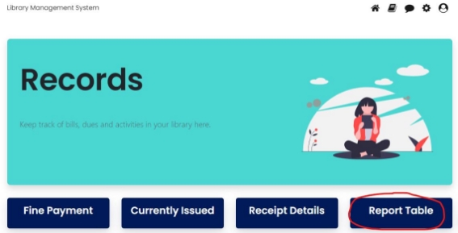

#### Report based on User

##### 1. Admin Report
1. To get a report of a particular admin or multiple admins, select “Admin” in user drop down.
2. Search and select  their name/s in Admin ID dropdown menu

3. You can easily customize your report by clicking on the checkboxes. For ADMIN report, you can make a report of the following:
    1. Issue Details
    2. Return Details
    3. Updated Books
    4. Books Deleted
    5. Added Books

##### 2. Teacher Report
1. To get a report of a particular  teacher or multiple teachers, select “Teacher” in user dropdown.
2. Search and select  their name/s in User ID dropdown menu
3. You can also select an admin in the Admin ID dropdown to get a report of the actions performed by the admins in association to the selected teachers

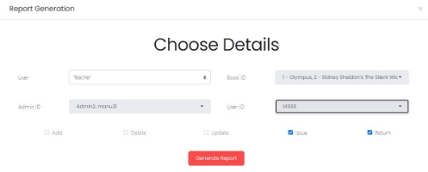

4. You can easily customize your report by clicking on the checkboxes. For TEACHER report, you can make a report of the following:
    1. Issue details
    2. Return Details
    
##### 3. Student Report
1. To get a report of a particular student or multiple students, select STUDENT in user drop down.
2. Search and select  their name/s in User ID dropdown menu
3. You can also select an admin in the Admin ID dropdown to get a report of the actions performed by the admins in association to the selected students.

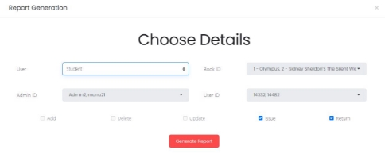

4. You can easily customize your report by clicking on the checkboxes. For STUDENT report, you can make a report of the following:
    1. Issue details
    2. Return Details

#### Report of a particular book

1. Reports of a particular book can be generated by selecting the Book name or Book ID in the BOOK ID section.
2. Multiple Book IDs can also be selected by clicking on the checkboxes.
3. Deselecting all the Book ID checkboxes will generate a report of all books in the Library.

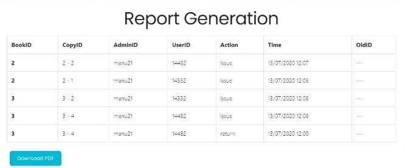

#### Report through a specific time period

1. Report can be generated for a specific time period by selecting a start and end time in the specified format (dd/mm/yyyy hh:mm)
2. If time is not specified, it will show all records of selected criteria.
3. If only End time is specified, all records from the first record(of that criteria) to the end time will be displayed.
4. If only Start time is specified, all records from the specified  time to the last record(of that criteria) will be displayed.

Reports can be generated periodically as well by changing the REPORT GENERATION DURATION in SETTINGS tab.

Check [CUSTOMIZE VIA SETTINGS](#settings) segment in this user doc for more information on that.

A PDF of the generated report can be downloaded by clicking on the _Download PDF button_ in the lower left corner of the page and can be accessed in the Downloads Section of your PC.

### Tracking currently issued books

This tab shows all the books currently issued by STUDENT or TEACHER and are yet to be returned.

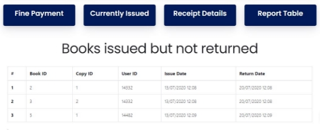

The table shows the USER ID alongside the COPY ID of the issued book. The ISSUE DATE and RETURN DATE are also mentioned.

### Clearing fines due

1. The FINE PAYMENT tab shows all the USERS who have fine payment due to the library.
2. The table shows the USER ID alongside the COPY ID of FINE amount.

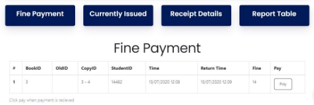

3. The table also shows the TIME i.e. when the book was supposed to be returned and RETURN TIME i.e. when the book was actually returned by the user.
4. Once the full FINE amount is paid by the user, 
 
 (pay button) should be clicked so that the FINE for the user is cleared.

### Tracking bills and receipts

1. When a specific BOOK ID is selected from the DROPDOWN, a table of receipts is shown.

A PDF of this RECEIPT can be downloaded and can be accessed in the Downloads Section of your PC.

  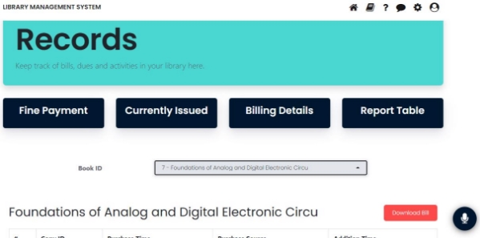

## Chatroom

### Who can chat here?
Anybody and everybody registered to the library can send text messages here. Click on the chat icon in the top right navigation bar to open Chatroom.

### How to block a user?
1. Click on the BLOCK button on the top right corner of the chatroom window.
2. In the Block row select the user you would like to block.

3. Search their name among all blocked users in the textbox and Click on the UNBLOCK button to unblock them.

How to unblock a user?

1. Click on the BLOCK button on the top right corner of the chatroom window.
1. In the Unblock row select the user you would like to unblock

3. Search their name among all blocked users in the textbox and Click on the UNBLOCK button to unblock them.

## Achievements/Leaderboard
Here you can view a list of all the students enrolled to your library in the descending order of their points gained. 

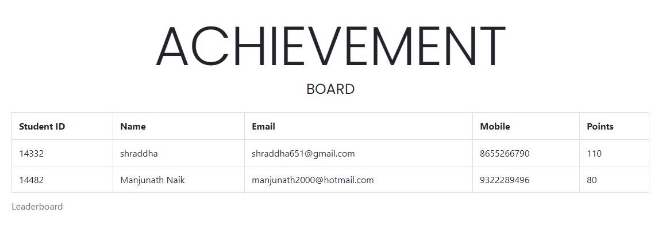

The leaderboard let’s you find out your regular and sincere users. You can decide how many points to award or deduct for various interactions of the user with the library in the settings.
For more details on point settings, check out the [customize via settings](#settings) section of this document.

